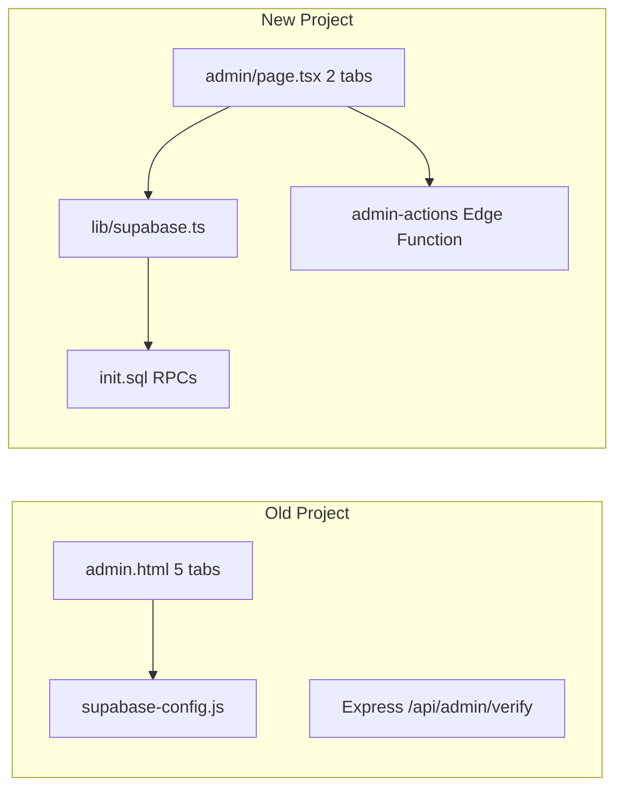

# Admin Parity Plan: Old vs New Project

## สรุปภาพรวม



โปรเจกต์ใหม่ refactor ฝั่ง parent ได้ดีแล้ว แต่ **admin ยังไม่ครบ** และมี **bug integration** ที่ทำให้ฟีเจอร์ที่มีอยู่ทำงานไม่ได้จริง

---

## 1. เปรียบเทียบ Admin Features

| Feature | Old (`admin.html`) | New (`admin/page.tsx`) | Status |
|---------|-------------------|------------------------|--------|
| Password gate | `/api/admin/verify` | Edge `verify-password` | มี แต่ต้องแก้ API shape |
| Tab: Daily attendance | ตาราง + อายุ + แพ้อาหาร + X/12 + Print | ตารางพื้นฐาน + checkbox ว่าง + cancel inline | **ขาด 60%** |
| Tab: Approve slips | Auto credits จาก metadata + confirm + Google Chat | Manual prompt credits + reject UI | **ขาด logic + bug API** |
| Tab: Manage credits | ค้นหาเบอร์ +/- credit + เหตุผล | ไม่มี | **ขาดทั้งแท็บ** |
| Tab: Override cancel | ค้นหาตามวัน + เหตุผล + refund + Google Chat | Cancel ใน daily tab ไม่มีเหตุผล | **ขาดแท็บ + notification** |
| Tab: Export CSV | UTF-8 BOM + 8 columns | ไม่มี | **ขาดทั้งแท็บ** |
| Walk-in registration | ไม่มี | มี form แต่ RPC ขาด | **ใหม่ แต่ broken** |
| Reject slip | ไม่มี | มี UI แต่ edge function ไม่มี | **ใหม่ แต่ broken** |
| Package options admin | hardcoded ใน apply.js | edge มี add/toggle แต่ไม่มี UI | **ใหม่ ยังไม่ expose** |

---

## 2. UX/UI Gaps (ต้อง port จาก old)

อ้างอิง: [`admin.html`](\\GES.local\User Data$\thirawut.k\Downloads\icsn-playgroup-class-booking-old\admin.html)

**Layout & design ที่ขาดใน new:**
- Sidebar tabs (sticky) แทน top tabs 2 อัน — ต้องขยายเป็น **7 แท็บ** (5 เดิม + walk-in ใน daily + package options)
- Bilingual labels (EN + TH subtext) ทุก section
- Logo ICSN บนหน้า login gate
- Pending slip badge count บน nav (มีแล้วบางส่วน)
- Empty states แบบ dashed border + icon
- **Print checklist** — `@media print` + `#print-area` พร้อมคอลัมน์ลายเซ็น + วันที่ไทย (พ.ศ.)
- Daily table columns: **อายุ**, **แพ้อาหาร** (badge สีแดง) — old มี new ไม่มี
- Capacity display: **X / capacity** — user เลือก configurable ต่อวัน

**Design tokens (ใช้เหมือนเดิม):**
- Purple `#211551`, Teal `#00B0B9`, Accent `#CC3366`
- Fonts: Sarabun + Outfit (new ใช้ Sarabun อย่างเดียว)

**แนะนำ refactor UI:**
- แยก [`src/app/admin/page.tsx`](src/app/admin/page.tsx) เป็น components ใน `src/components/admin/` (DailyTab, SlipsTab, CreditsTab, CancelTab, ExportTab, PackageOptionsTab) — ไฟล์ปัจจุบัน 330 บรรทัดจะโตเป็น 800+ ถ้าไม่แยก

---

## 3. Logic Gaps

### 3.1 Bug วิกฤต — Admin API contract ไม่ตรงกัน

[`admin/page.tsx`](src/app/admin/page.tsx) ส่ง body แบบ flat:
```typescript
{ action: 'cancel-booking', password, bookingId, cancelReason }
```

[`admin-actions/index.ts`](supabase/functions/admin-actions/index.ts) คาดหวัง:
```typescript
{ action, password, payload: { bookingId, cancelReason } }
```

**ผล:** approve-slip, cancel-booking, reject-slip ล้มเหลวทั้งหมดใน production

**Fix:** สร้าง helper `invokeAdminAction(action, payload)` ใน [`src/lib/supabase.ts`](src/lib/supabase.ts) ให้ทุก admin call ใช้ shape เดียวกัน

### 3.2 RPC / DB functions ที่ขาดใน [`init.sql`](init.sql)

| Function | ใช้ที่ | Action |
|----------|--------|--------|
| `admin_book_class(child_id, session_id, is_free)` | Walk-in booking | **ต้องสร้าง** — book + optional skip credit deduct |
| `admin_edit_user(table, id, data)` | แก้ parent/child (optional) | สร้างถ้าต้องการ edit ใน admin |
| `adjust_credits(parent_id, amount, reason)` | Credits tab | **ต้องสร้าง** + เขียน `credit_transactions` |
| `admin_cancel_booking(id, reason)` | Cancel tab | รวม refund + trigger + bypass 7am rule |

**`cancel_booking` RPC ปัจจุบัน** ไม่ set `cancelled_by`, `cancel_reason`, ไม่ enforce 7:00 rule — parent cancel ใช้ client-side disable อย่างเดียว ([`my-bookings/page.tsx`](src/app/my-bookings/page.tsx))

### 3.3 Logic จาก old ที่ต้อง port

จาก [`supabase-config.js`](\\GES.local\User Data$\thirawut.k\Downloads\icsn-playgroup-class-booking-old\supabase-config.js):

- **`adjustCredits`**: ค้นหา package type `purchase`, floor at 0, return updated total
- **`approveSlip`**: parse `||credits:N||` จาก `file_url` OR ใช้ `package_options.credits` (new มีแล้วใน edge แต่ UI override ด้วย prompt)
- **`cancelBooking('admin')`**: bypass 7:00 Bangkok rule, set `cancelled_by='admin'`, refund +1, decrement `sessions.booked_count`, Google Chat
- **`getExportCSVData`**: flatten parents + first child + total credits + booking dates
- **`getDailyAttendance`**: join child age + food_allergy

### 3.4 Notifications

- Old: client → `/api/notify` → Google Chat (approve + admin cancel)
- New: Google Chat อยู่ใน edge function approve-slip เท่านั้น; **admin cancel ไม่ notify**; parent booking ไม่ notify
- Fix: เรียก [`/api/notify`](src/app/api/notify/route.ts) จาก edge function หรือ client หลัง admin cancel/approve

### 3.5 Capacity (user เลือก: configurable)

- Old: hardcode 12 ใน `sessions.capacity`
- New: `sessions.total_capacity` default 15, `time_label` support multi-slot
- **Plan:** แสดง `booked_count / total_capacity` ใน daily tab; เพิ่ม UI ให้ admin แก้ `total_capacity` และ `is_active` ต่อวันใน daily tab (inline edit หรือ modal)

---

## 4. Database Gaps

### Tables ใหม่ที่ old ไม่มี (ต้อง integrate ไม่ใช่ลบ)

| Table | Purpose | Admin action needed |
|-------|---------|---------------------|
| `package_options` | แพ็กเกจที่ admin กำหนด | Tab จัดการ: add / toggle active / แสดง credits+price |
| `credit_transactions` | Audit log | เขียนทุกครั้งที่ adjust/approve/walk-in/cancel |
| `system_settings` | Config ใน DB | Optional: ย้าย admin password จาก env → DB (ไม่จำเป็นตอนนี้) |

### Schema differences สำคัญ

| Field | Old | New | Impact |
|-------|-----|-----|--------|
| `sessions.capacity` | 12, unique date | `total_capacity` 15, `(date, time_label)` unique | Query cancel ใน edge ใช้ `.single()` อาจ fail ถ้ามีหลาย time slot |
| `children.photo_url` | ไม่มี | มี | Export CSV อาจเพิ่ม column optional |
| `children.special_info` | ไม่มี | มี | แสดงใน daily ถ้าต้องการ |
| `slip_uploads.package_id` | ไม่มี | มี (FK to package_options) | Approve ใช้ credits จาก option แทน parse URL |
| `slip_uploads.status` | pending/approved | + rejected | Reject flow ใหม่ |
| `packages.type` | trial/purchase enum-like | text (ชื่อแพ็กเกจ) | Credits tab ต้อง sum ทุก package ไม่ filter type เดียว |

### Indexes ที่ old มี new ขาด

Old [`init.sql`](\\GES.local\User Data$\thirawut.k\Downloads\icsn-playgroup-class-booking-old\init.sql) มี indexes บน phone, parent_id, session_date — **ควรเพิ่มใน new init.sql** สำหรับ performance

---

## 5. ฟีเจอร์ใหม่ที่ต้อง integrate เข้า Admin (ไม่ใช่แค่ port)

จากโปรเจกต์ใหม่ที่ parent side ทำแล้ว:

1. **Walk-in** — อยู่ใน daily tab แล้ว; ต้องสร้าง `admin_book_class` RPC + แสดง badge "Walk-in" ในรายชื่อ
2. **Reject slip** — เพิ่ม `reject-slip` action ใน edge function; set status `rejected` + optional notify
3. **Package options CRUD** — Tab ใหม่ ใช้ edge `add-package` / `toggle-package` ที่มีอยู่แล้ว
4. **Supabase Auth parents** — Credits/Cancel search ต้องรองรับ parent ที่ login ด้วย email (ไม่ใช่แค่ phone walk-in)
5. **Multi time slot** — Daily tab อาจต้อง filter by `time_label` ถ้ามีมากกว่า 1 slot/วัน

---

## 6. Implementation Plan (ลำดับงาน)

### Phase A — Fix broken foundation (ทำก่อน UI)

1. สร้าง `invokeAdminAction()` helper — แก้ payload contract ทุก admin call
2. เพิ่ม SQL functions ใน [`init.sql`](init.sql):
   - `admin_book_class`
   - `adjust_credits` (+ insert `credit_transactions`)
   - ปรับ `cancel_booking` ให้รับ `cancelled_by`, `cancel_reason` และ enforce 7am เฉพาะ parent
3. เพิ่ม `reject-slip` ใน [`admin-actions/index.ts`](supabase/functions/admin-actions/index.ts)
4. แก้ `cancel-booking` edge action: ใช้ `session_id` แทน `.single()` on date; เรียก trigger หรือ RPC แทน manual booked_count
5. เพิ่ม DB indexes จาก old schema

### Phase B — Port 5 tabs จาก old + UX parity

6. Refactor admin เป็น `src/components/admin/*`
7. **DailyTab**: age, allergy badge, capacity X/Y (editable), print checklist, walk-in form, inline cancel
8. **SlipsTab**: auto credits จาก `package_options` / metadata, confirm dialog, approve + reject, Google Chat
9. **CreditsTab**: phone search → show packages sum → +/- with required reason → `adjust_credits` RPC
10. **CancelTab**: date search → list bookings → reason required → admin cancel + Google Chat
11. **ExportTab**: port `getExportCSVData` logic → client CSV download with BOM

### Phase C — New features integration

12. **PackageOptionsTab**: list / add / toggle active (edge functions พร้อมแล้ว)
13. Wire `credit_transactions` audit ทุก mutation
14. Login gate: logo + bilingual copy ตาม old

### Phase D — Verify

15. Manual test checklist:
    - Walk-in free / paid
    - Approve slip (package_options credits)
    - Reject slip
    - Adjust credits +/- with reason
    - Admin cancel with reason + refund
    - Parent cancel blocked after 7:00 (server-side)
    - Export CSV opens correctly in Excel Thai
    - Print checklist
    - Edit session capacity for a date

---

## 7. Files หลักที่จะแก้

| File | Changes |
|------|---------|
| [`init.sql`](init.sql) | New RPCs, indexes, cancel_booking upgrade |
| [`supabase/functions/admin-actions/index.ts`](supabase/functions/admin-actions/index.ts) | reject-slip, adjust-credits, fix session lookup, optional custom credits |
| [`src/lib/supabase.ts`](src/lib/supabase.ts) | `invokeAdminAction`, `adjustCredits`, `getExportCSVData`, `getDailyAttendance` |
| [`src/app/admin/page.tsx`](src/app/admin/page.tsx) | Refactor → shell + tabs |
| `src/components/admin/*.tsx` | **New** — 7 tab components |
| [`src/types/index.ts`](src/types/index.ts) | Admin types, extend Package.type |

---

## 8. สิ่งที่ไม่ต้อง port (by design)

- LocalStorage fallback mode (old `AppDB.isReal`) — new ใช้ Supabase เท่านั้น
- Express `/api/admin/verify` — แทนด้วย edge function แล้ว
- Hardcoded package list ใน apply.js — แทนด้วย `package_options` table
- Storage bucket `icsn_uploads` — new ใช้ `profiles` + `slips`
